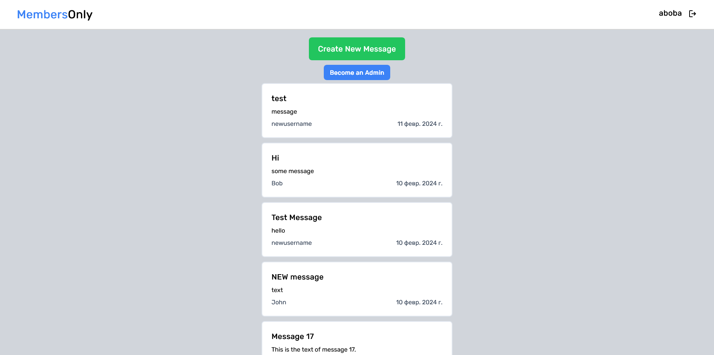

# Members Only Application

Members Only is an exclusive clubhouse where anyone can come and see the messages but only logged-in users can write new messages. To see who created the message and when users have to get the membership by entering a passcode. There's also an admin who can see all the messages with author, date, and time, and can also delete the messages.

**🔑 Passcode: `secretcode`**

## Features

- Create and Read messages.
- User authentication with JWTs (JSON Web Token).
- User authorization and permissions management (Admin, member, and non-member but registered user).
- Securing passwords using bcryptjs.
- Membership by entering a secret code.
- Schema validation using Mongoose.

## Technologies Used

- React
- Tailwindcss
- Node.js
- Express
- MongoDB
- Mongoose
- bcryptjs
# midterm_project
